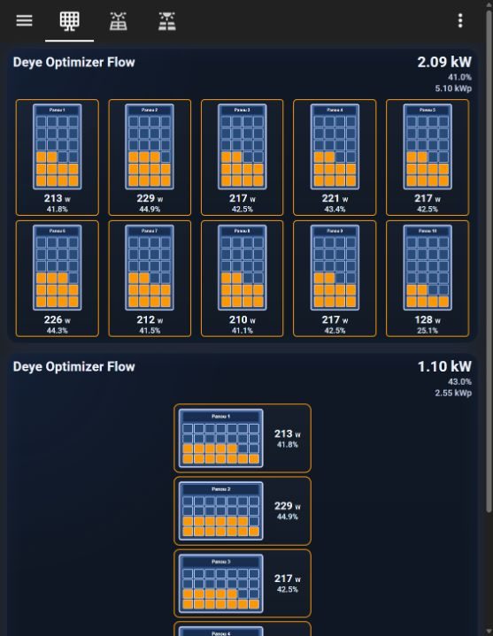
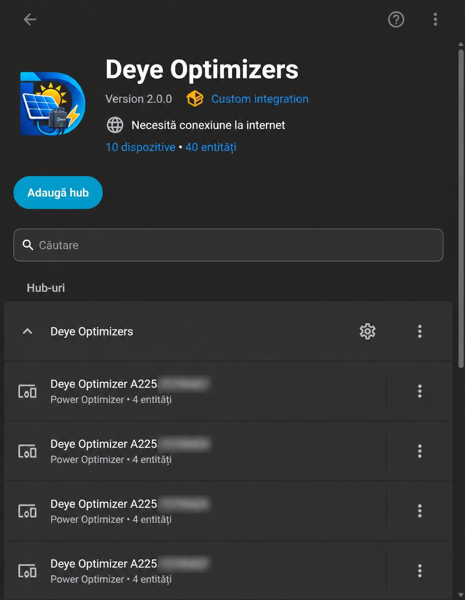
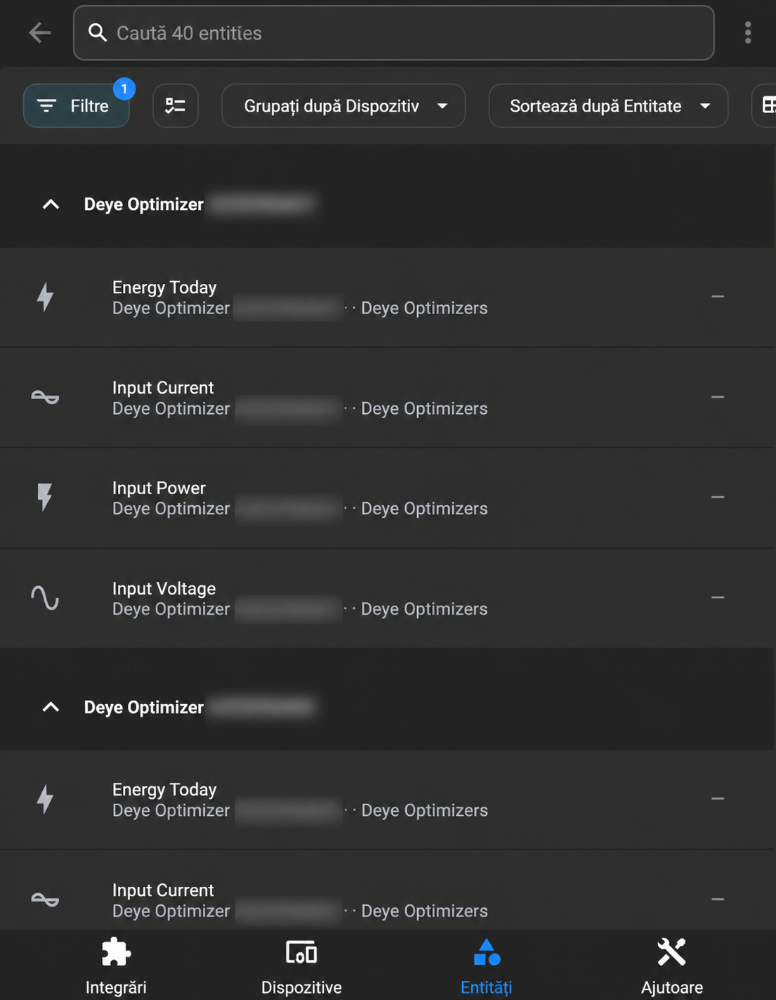

# Deye Optimizers 2.1.2

Community Home Assistant integration for Deye Power Optimizers through Deye Cloud. Version 2.1.2 includes stable optimizer sensors, resilient polling, diagnostics, and the **Deye Optimizer Flow** dashboard card.

> **Solarman is not required.** This integration connects directly to Deye Cloud using your Deye token and station ID. You can use the Solarman integration separately for inverter data, but it is not a dependency of Deye Optimizers.

> This is not an official Deye integration. Never publish your Deye token.



## What it looks like

| Integration and discovered devices | Optimizer entities |
|---|---|
|  |  |

Serial numbers in the screenshots are intentionally blurred.

## Features

- automatic discovery of all `OPTIMIZER` devices in a Deye station;
- voltage, current, power, and daily-energy sensors per optimizer;
- configurable refresh every 30–900 seconds;
- retry, timeout, partial-update handling, and retention of the last valid values;
- stable unique IDs based on optimizer serial numbers;
- diagnostics with credentials redacted;
- included responsive dashboard card with a fixed 1–6 × 1–6 grid;
- global portrait or landscape orientation that does not change on phones.

## Installation with HACS

1. Open **HACS → Integrations**.
2. Open the menu and choose **Custom repositories**.
3. Add `https://github.com/andrexyx/deye-optimizers` as category **Integration**.
4. Install **Deye Optimizers** and restart Home Assistant.
5. Go to **Settings → Devices & services → Add Integration**.
6. Search for **Deye Optimizers**, then enter your token and Station ID.

The illustrated token guide is in [docs/GET_DEYE_TOKEN.md](docs/GET_DEYE_TOKEN.md).

### Deye Token Assistant

For beginners, use the **Deye Token Assistant browser extension** from the latest release. Sign in on the official Deye Cloud page, open your station, and the extension detects the token and station ID automatically—no Developer Tools and no Deye password entered into the extension. Follow the [beginner guide](docs/BEGINNER_TOKEN_GUIDE.md).

The [manual web assistant](https://andrexyx.github.io/deye-optimizers/tools/token-assistant.html) remains available as a fallback for advanced users.

Full instructions and security notes are in [docs/TOKEN_ASSISTANT.md](docs/TOKEN_ASSISTANT.md).

## Manual installation

1. Download and extract the latest GitHub release.
2. Copy `custom_components/deye_optimizers` into `/config/custom_components/`.
3. Restart Home Assistant.
4. Open **Settings → Devices & services → Add integration** and search for **Deye Optimizers**.
5. Enter the Deye Cloud token and Station ID. Solarman is not required.

## Refresh interval

Open **Settings → Devices & services → Deye Optimizers → Configure**. Choose a value between 30 and 900 seconds. Start with 60 seconds; aggressive polling can trigger Deye Cloud limits.

## Sensors

Each optimizer exposes:

- `Input Voltage` (V)
- `Input Current` (A)
- `Input Power` (W)
- `Energy Today` (kWh)

Entities also include serial number, optimizer ID, station ID, device status, and last update attributes.

## Install the dashboard card

Copy this repository file:

`custom_components/deye_optimizers/frontend/deye-optimizer-flow-card.js`

to:

`config/www/deye-optimizer-flow-card.js`

Then add a dashboard resource:

```yaml
url: /local/deye-optimizer-flow-card.js?v=2.1.2
type: module
```

After updating the file, reload Lovelace resources or restart Home Assistant and refresh the browser without cache.

## Minimal card configuration

```yaml
type: custom:deye-optimizer-flow-card
columns: 5
rows: 2
orientation: portrait
panels:
  - sensor.deye_optimizer_SERIAL1_input_power
  - sensor.deye_optimizer_SERIAL2_input_power
  - sensor.deye_optimizer_SERIAL3_input_power
  - sensor.deye_optimizer_SERIAL4_input_power
  - sensor.deye_optimizer_SERIAL5_input_power
```

Both `columns` and `rows` accept values from 1 to 6. The card never changes them based on the viewport; it scales its contents instead. Capacity is `columns × rows`; additional panel entries are not displayed.

## Card options

| Option | Default | Description |
|---|---:|---|
| `columns` | `5` | Fixed number of columns, 1–6 |
| `rows` | automatic | Fixed number of rows, 1–6 |
| `orientation` | `portrait` | `portrait` or `landscape`, applied to the entire grid |
| `rated_power` | `550` | Default nominal panel power in Wp |
| `gap` | `6` | Maximum gap in pixels |
| `show_header` | `true` | Show title and total power |
| `show_total_power` | `true` | Show total visible power |
| `show_today_energy` | `true` | Show the summed `Energy Today` value below the title |
| `today_energy_label` | `Produced today` | Label used for the daily-production total |
| `show_percent` | `true` | Show production percentage |
| `show_empty_slots` | `false` | Render unused positions as muted slots |
| `color_100`, `color_60`, `color_20`, `color_0` | included | Production colors |

Each panel may be a simple entity string or an object with `entity`, `name`, and optional per-panel `rated_power`.
Click or press Enter on a panel to open its standard Home Assistant history dialog. The card derives each daily-energy
entity by replacing `_input_power` with `_energy_today`; set `energy_entity` on a panel when your entity ID does not
follow that convention. Complete portrait and landscape files are in [`examples/`](examples/).

### Four strings with up to 25 panels each

The integration requests up to 200 optimizers from a station, so installations with four strings (A–D) and 25 optimizers per string are supported. For a clear dashboard, use one `5 × 5` card per string. See [`examples/card-string-5x5.yaml`](examples/card-string-5x5.yaml).

## Troubleshooting

- `401`/`403`: get a fresh Deye token and re-add the integration.
- No optimizers: verify the Station ID and confirm the station contains `OPTIMIZER` devices.
- Old card remains visible: increment the resource query version and clear the browser cache.
- Temporary Deye outage: 2.0 keeps the last valid values; check the integration diagnostics for the partial error.

## Support

Please report reproducible problems through [GitHub Issues](https://github.com/andrexyx/deye-optimizers/issues). Remove tokens, station IDs, optimizer serial numbers, and other private data from screenshots and logs.
