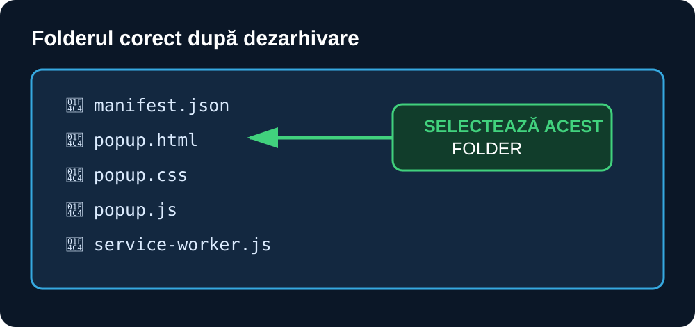
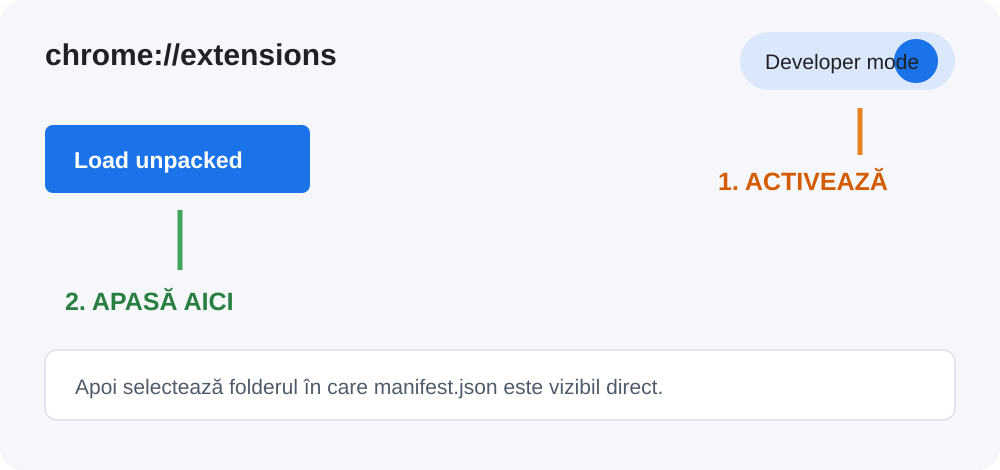
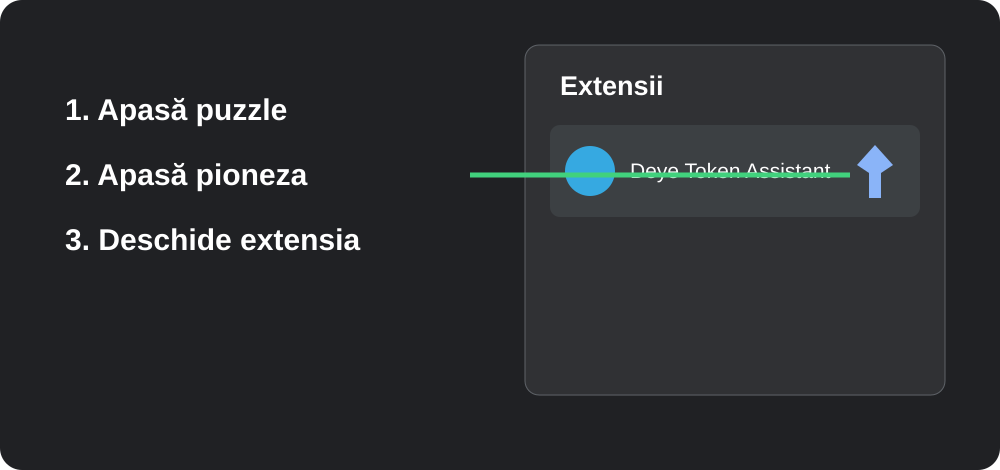
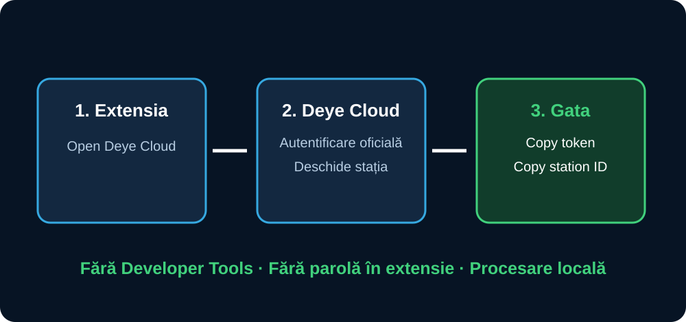

# Deye Token Assistant — tutorial pentru începători

Extensia găsește automat tokenul Deye și ID-ul stației. Nu ai nevoie de Developer Tools și nu introduci parola Deye în extensie.

> **Important:** autentificarea se face numai pe site-ul oficial Deye Cloud. Nu publica tokenul și nu îl trimite în chat.

## 1. Descarcă extensia

Descarcă arhiva **`deye-token-assistant-extension.zip`** din [ultima versiune publicată](https://github.com/andrexyx/deye-optimizers/releases/latest).

În Windows, apasă clic dreapta pe arhivă și alege **Extract All / Extrage tot**.

Folderul extras trebuie să conțină direct aceste cinci fișiere:

```text
manifest.json
popup.html
popup.css
popup.js
service-worker.js
```



Nu selecta folderul proiectului, `docs`, `tools` sau arhiva ZIP.

## 2. Deschide pagina extensiilor

Scrie în bara de adresă:

- Chrome: `chrome://extensions`
- Microsoft Edge: `edge://extensions`

Activează **Developer mode / Mod dezvoltator**.

Apasă **Load unpacked / Încărcați extensia neîmpachetată**.



## 3. Alege folderul corect

În fereastra Windows, deschide folderul extras și selectează folderul în care vezi direct `manifest.json`.

Apasă **Select Folder / Selectare folder**.

Dacă apare „Manifest missing”, ai ales folderul părinte sau `docs`. Revino și selectează exact folderul cu `manifest.json`.

## 4. Fixează extensia în bara browserului

Apasă pictograma puzzle **Extensions / Extensii**, găsește **Deye Token Assistant** și apasă pioneza.



## 5. Capturează automat datele

1. Deschide extensia din bara browserului.
2. Apasă **Open Deye Cloud**.
3. Autentifică-te normal pe pagina oficială Deye Cloud.
4. Deschide stația/centrala fotovoltaică.
5. Reîncarcă pagina stației o singură dată (`Ctrl+R`).
6. Deschide iar extensia.

Extensia trebuie să afișeze **Ready for Home Assistant**, butoanele **Copy token** și **Copy station ID**.



## 6. Configurează Home Assistant

În Home Assistant:

1. Deschide **Settings → Devices & services**.
2. Apasă **Add integration**.
3. Caută **Deye Optimizers**.
4. Apasă **Copy token** în extensie și lipește valoarea în câmpul **Deye Cloud token**.
5. Apasă **Copy station ID** și lipește valoarea în **Station ID**.
6. Confirmă formularul.

## 7. Șterge datele sensibile

După configurare, apasă **Clear captured data** în extensie. Poți apoi să dezactivezi sau să ștergi extensia. Tokenul este păstrat numai în memoria sesiunii browserului și este eliminat și la închiderea completă a browserului.

## Dacă nu apare „Ready for Home Assistant”

Verifică în ordine:

1. Ești autentificat pe un domeniu oficial `*.deyecloud.com`.
2. Ai deschis efectiv o stație, nu doar lista de stații.
3. Ai reîncărcat pagina stației după instalarea extensiei.
4. Extensia este activată în `chrome://extensions` sau `edge://extensions`.

Dacă tot nu funcționează, folosește temporar [asistentul manual](https://andrexyx.github.io/deye-optimizers/tools/token-assistant.html) și deschide o problemă pe GitHub fără parole, tokenuri sau serii reale.

## Ce permisiuni folosește

- acces numai la cererile HTTPS către `*.deyecloud.com`;
- `webRequest` pentru citirea antetului de autorizare;
- `storage.session` pentru păstrarea temporară a tokenului și stației;
- `tabs` doar pentru butonul care deschide pagina oficială Deye Cloud.

Extensia nu conține analytics, reclame, server propriu sau transmitere externă de date.
